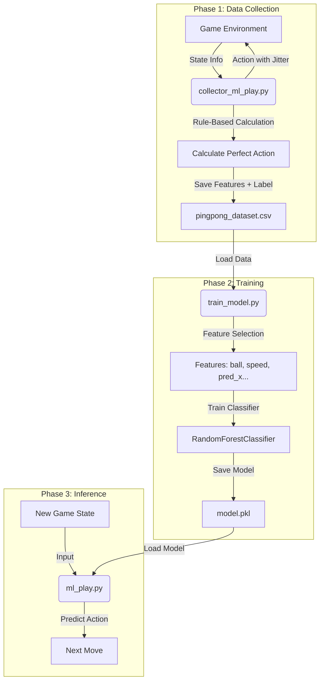

# 專案架構總覽（Breakdown）

本專案是一個「以 Random Forest 訓練 1P 乒乓球 AI，與 2P 規則型對手對戰」的完整系統，包含環境模擬、機器學習、對手 AI、視覺化遊玩與分析工具。

## 系統組成
1. Environment (env_paia.py): 遊戲物理環境，負責球的移動、碰撞檢測與遊戲狀態更新。
2. Data Collector (collector_ml_play.py): 一個基於規則（Rule-Based）的腳本，負責玩遊戲並將「當下的狀態（特徵）」與「採取的動作（標籤）」存成 CSV 檔。
3. Model Training: 使用 Scikit-Learn 的 RandomForestClassifier 讀取 CSV 進行訓練。
4. Inference Agent (ml_play.py): 實際比賽用的腳本，載入訓練好的模型，根據當前局勢預測動作。

## Random Forest 設定與訓練流程
### 1. 資料收集與特徵工程 (Data Collection & Features)
不同於 DQN 的 Reward 機制，Random Forest 需要明確的「輸入特徵」與「正確答案」。
- 資料來源：由 collector_ml_play.py 自動遊玩收集。
 - 輸入特徵 (Features, X)：
    - ball_x, ball_y: 球的座標
    - speed_x, speed_y: 球的速度向量
    - **pred_x: 物理預測落點(使用公式推導出的結果，模型主要學習此值)**
    - my_x: 我方板子位置
    - op_x: 對方板子位置
  - 輸出標籤 (Label, Y)：
    - 動作分類：MOVE_LEFT (0), MOVE_RIGHT (1), NONE (2)
  - 資料處理策略：
    - 去重 (Drop Duplicates)：移除完全重複的狀態。
    - 平衡 (Balancing)：確保 MOVE_LEFT, MOVE_RIGHT, NONE 的資料筆數接近，避免模型傾向於「站著不動」。

### 2. 模型超參數 (Hyperparameters)
使用 sklearn.ensemble.RandomForestClassifier。
- 基本設定：
    - n_estimators: 100 (樹的數量，越多越穩定但計算越慢)
    - max_depth: 10 ~ 20 (樹的深度，太深會導致 Overfitting，太淺會 Underfitting)
    - min_samples_split: 5 (節點分裂所需的最小樣本數)
    - criterion: "gini" 或 "entropy"
    - Split: 80% 訓練集 / 20% 測試集
    - 資料清洗: 自動移除含有 NaN 的資料列，並強制轉型為數值。
  - 防止 Overfitting 策略：
    - 限制 max_depth。
    - 增加資料多樣性（在 Collector 中加入隨機擾動 Jitter）。

### 3. 2P 對手設定 (Opponent)
  - 與 DQN 版本相同，作為測試基準。
    - Simple-Follow AI: 基礎追球。
    - Predictive AI: 計算落點進行回擊，可調整容錯率。

## 測試與專案管理（Testing & Management Layer）

### 測試清單
- 單元測試
  - 環境測試
    - Test_reset：確保環境初始化
    - Test_update_ball：人工指定球的位置與速度，測試球的碰撞、邊界、出局
    - Test_obstacle：hard 模式下，障礙物的位置、移動、碰撞
  - Random Forest 模型測試
    - Test_feature_shape：確認輸入模型的 Feature 維度是否與訓練時一致 (例如是否缺了 speed_y)。
    - Test_inference_speed：確保模型預測時間小於遊戲 Frame 時間 (例如 < 0.016s)。
    - Test_accuracy：使用測試集 (Test Set) 驗證準確率 (Accuracy) 與混淆矩陣 (Confusion Matrix)。
    - Test_overfitting：檢查 Training Score 與 Testing Score 的差距。
- 整合測試
  - Test_episode_run：env.reset → 500steps → 確保不會crash
  - Test_train_100_steps：執行100 steps DQN，𝜃 會更新
  - Test_play_agent：使用play_paia_agent實際跑一分鐘
  - Test_hard_mode_with_obstacle：hard模式下，障礙物存在且會阻擋球
  - Test_loss_position_analysis：測試analyze_miss_position能夠蒐集lose資料

# 網頁連結
- https://app.paia-arena.com/zh/game/3

